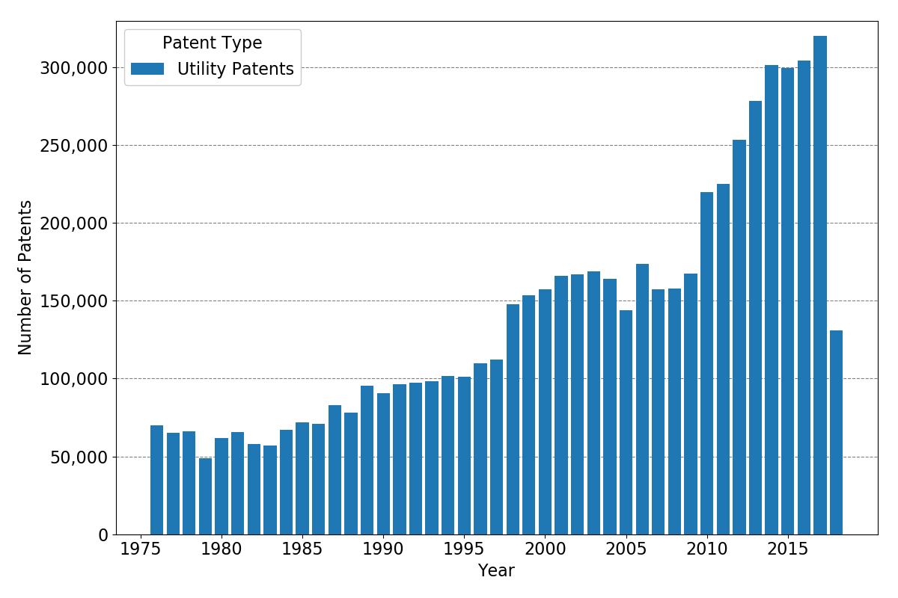
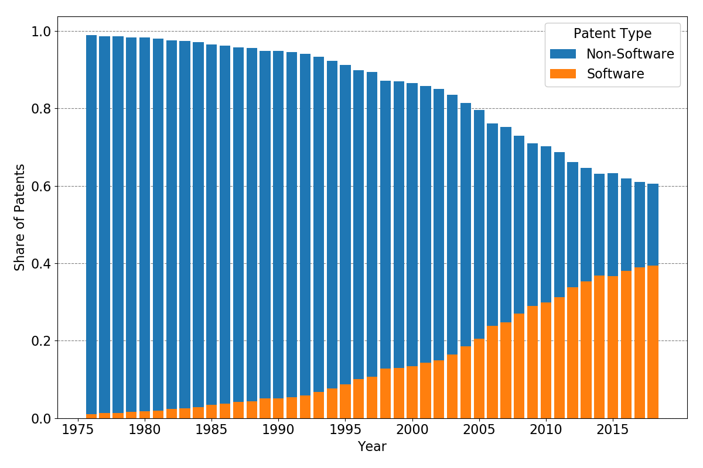

# Identification of Software Patents

[](https://results.pre-commit.ci/latest/github/tobiasraabe/software_patents/main)

[](https://github.com/psf/black)

## Introduction

This project deals with the identification of software patents and combines multiple
approaches from simple algorithms to novel machine learning models to achieve this goal.

## Background

The origin of this project was a Bachelor's thesis built on the algorithmic approach of
[\[BH2007\]](#BH2007){.citation}. The authors wanted to estimate the number of software
patents and find out where software patents are used and what economic indicators are
correlated with the amount of software patents in certain industries.

To classify patents into categories of software and non-software, the authors developed
a simple algorithm based on the evaluation of a random sample of patents. The algorithm
is as follows:

> (("software" in specification) OR ("computer" AND "program" in specification))
>
> AND (utility patent excluding reissues)
>
> ANDNOT ("chip" OR "semiconductor" OR "bus" OR "circuit" OR "circuitry" in title)
>
> ANDNOT ("antigen" OR "antigenic" OR "chromatography" in specification)

Whereas the title is simply identified, the specification is defined as the abstract and
the description of the patent ([\[PATENTSVIEW\]](#PATENTSVIEW){.citation} separates the
description in [\[BH2007\]](#BH2007){.citation} definition into description and
summary).

To replicate the algorithm, the project relies on two strategies. The first data source
is [Google Patents](https://patents.google.com/) where the texts can be crawled. As this
procedure is not feasible for the whole corpus of patents, the second data source is
[\[PATENTSVIEW\]](#PATENTSVIEW){.citation} which provides large data files for all
patents from 1976 on.

The replication of the original algorithm succeeds in 398 of 400 cases as one patent was
retracted and in one case an indicator was overlooked which lead to a error in the
classification.

Compared to the manual classification of the authors, the algorithm performed in the
following way:

+-------------------+----------+--------------+ | | Relevant | Not Relevant |
+===================+==========+==============+ | **Retrieved** | > 42 | > 8 |
+-------------------+----------+--------------+ | **Not Retrieved** | > 12 | > 337 |
+-------------------+----------+--------------+

Relevant refers to software patents according to the manual classification whereas
retrieved indicates software patents detected by the algorithm. The upper left corner
can also be called true-positives whereas the lower right corner shows the number of
true-negatives.

Applying the algorithm on the whole patent corpus, we get the following distributions of
patents and software versus non-software patents.

```{=html}
<p align="center">
    <b>Absolute Number of Utility Patents</b><br>
    
</p>
```

```{=html}
<p align="center">
    <b>Absolute Number of Software vs. Non-Software Patents</b><br>
    
</p>
```

```{=html}
<p align="center">
    <b>Relative Number of Software vs. Non-Software Patents</b><br>
    
</p>
```

## Installation

To play with the project, clone the repository to your disk with

```bash
$ git clone https://github.com/tobiasraabe/software_patents
```

After that create an environment with `conda` and activate it by running

```bash
$ conda env create -n sp -f environment.yml
$ activate sp
```

If you only want to download the files for reproducing the analysis based on the
indicators, run the following commands for downloading and validating:

```bash
$ python prepare_data_for_project download --subset replication
$ python prepare_data_for_project validate
```

(If you want to have the raw data or everything, use `--subset raw` or `--subset all`.
Note that, you need about 60GB of free space on your disk. Furthermore, handling the raw
data requires an additional step where the files are split into smaller chunks, so that
they can fit into the memory of your machine. These steps require knowledge about
[Dask](https://dask.pydata.org/en/latest/). You can find more on this
[here \<https://github.com/tobiasraabe/software_patents/blob/master/src/documentation/ data.rst>](<>).)

Then, run the following two commands to replicate the results.

```bash
$ pytask
```

## References

::: {#citations}

\[BH2007\]{#BH2007 .citation-label}

: <https://onlinelibrary.wiley.com/doi/pdf/10.1111/j.1530-9134.2007.00136.x>

\[PATENTSVIEW\]{#PATENTSVIEW .citation-label}

: <http://www.patentsview.org/download/> :::
