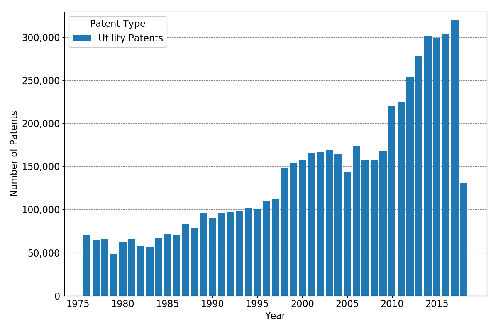
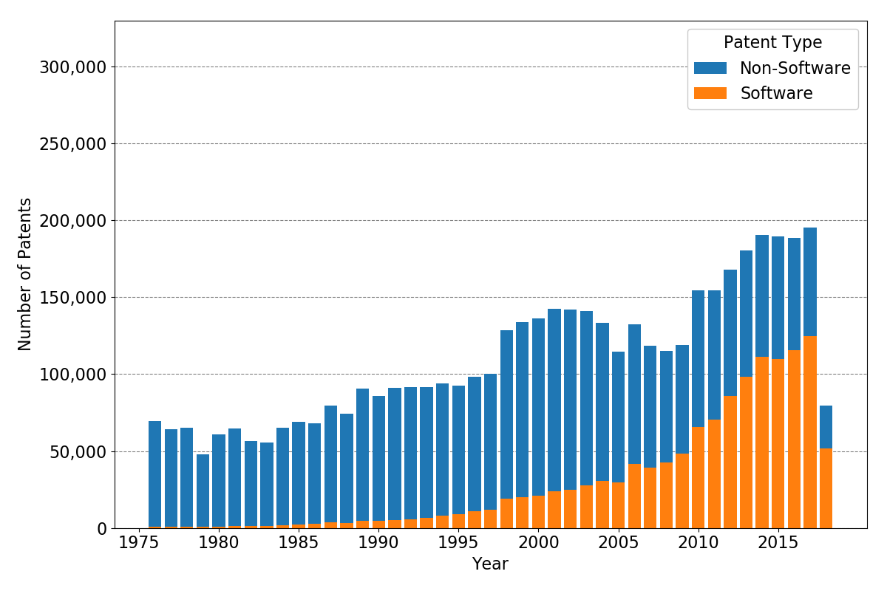
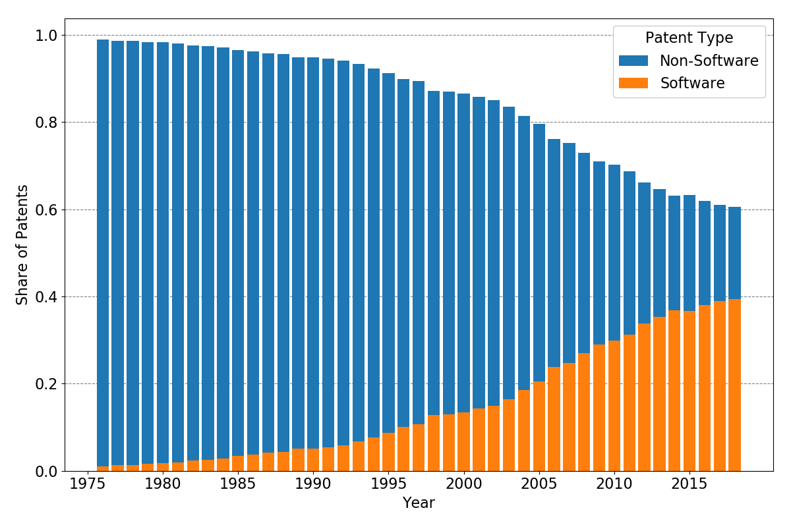

Introduction
============

This project deals with the identification of software patents and combines
multiple approaches from simple algorithms to novel machine learning models to
achieve this goal.

Background
==========

The origin of this project was a Bachelor's thesis built on the algorithmic
approach of [BH2007]_. The authors wanted to estimate the number of software
patents and find out where software patents are used and what economic
indicators are correlated with having more software patents.

To classify patents into categories of software and non-software, the authors
developed a simple alogrithm based on the evaluation of a random sample of
patents. The algorithm is as follows:

..

    (("software" in specification) OR ("computer" AND "program" in
    specification))

    AND (utility patent excluding reissues)

    ANDNOT ("chip" OR "semiconductor" OR "bus" OR "circuit" OR "circuitry" in
    title)

    ANDNOT ("antigen" OR "antigenic" OR "chromatography" in specification)

Whereas title is simply identified, specification is defined as the abstract
and the description of the patent ([PATENTSVIEW]_ separates the description in
[BH2007]_ definition into description and summary).

To replicate the algorithm, the project relies on two strategies. The first
data source is `Google Patents <https://patents.google.com/>`_ where the texts
can be crawled. As this procedure is not feasible for the whole corpus of
patents, the second data source is [PATENTSVIEW]_ which provides large data
files for all patents from 1976 on.

The replication of the original algorithm succeeds in 398 of 400 cases as one
patent was retracted and in one case an indicator was overlooked which lead to
a error in the classification.

Compared to the manual classification of the authors, the algorithm performed
in the following way:

+-------------------+----------+--------------+
|                   | Relevant | Not Relevant |
+===================+==========+==============+
| **Retrieved**     |       42 |            8 |
+-------------------+----------+--------------+
| **Not Retrieved** |       12 |          337 |
+-------------------+----------+--------------+

Applying the algorithm on the whole patent corpus, we get the following
distributions of patents and software versus non-software patents.

List of Analyses and Todos
==========================

The are many types of analyses which are already implemented or planned.

- [x] Replication of the algorithm of [BH2007]_.
- [ ] Replacing old results of Random Forest implementation with a current
  implementation.
- [ ] Improving the algorithm of Bessen and Hunt (2007) on the same indicator
  data with machine learning methods.
- [ ] Machine and deep learning techniques using textual data.
- [ ] Network analysis of patents with the citation data at [PATENTSVIEW]_.

.. rubric:: References

.. [BH2007] https://onlinelibrary.wiley.com/doi/pdf/10.1111/j.1530-9134.2007.00136.x
.. [PATENTSVIEW] http://www.patentsview.org/download/
